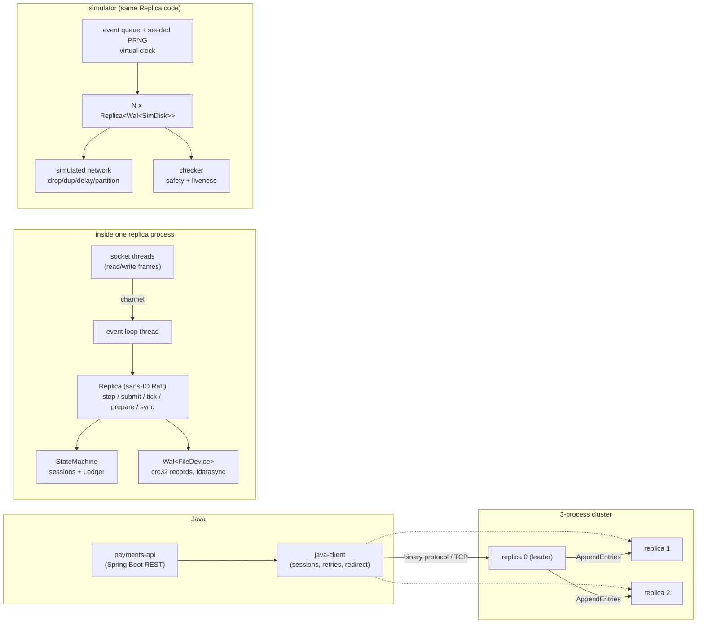

# quorum-ledger

**[Open the live demo](https://leads.realalma.com/fintech/quorum-ledger/)** · Transfer, retry, hold, and capture against the live three-node cluster. All data is synthetic.

A replicated double-entry ledger in Rust, tested with deterministic simulation,
with a Java client and a Spring Boot payments API on top.

> **Personal portfolio project.** It is not used in production, has no users,
> and is missing things a production ledger needs (see
> [Limitations](#limitations)). Every number below was measured on the machine
> described, with the commands given.

What is in the box:

* **Ledger state machine** (Rust): accounts and transfers with `u128` amounts
  and ids, balance-limit flags, single-phase and two-phase (hold / capture /
  void) transfers with timeouts, idempotent creation by id. Invariants: per
  ledger, total debits equal total credits; every balance equals the sum of the
  transfers that touch it; account flags are never violated.
* **Replication**: Raft (3 replicas by default, any odd number up to 16) with
  leader election, log replication, commit index, fast log repair of lagging
  replicas, client-session deduplication, check-quorum and request batching.
  The replica is a sans-IO state machine; storage and network are behind traits.
* **Storage**: an append-only, checksummed write-ahead log with group commit;
  torn and corrupted tails are detected and cut on recovery.
* **Deterministic simulation testing** (the headline): the whole cluster plus
  clients run single-threaded from one seed with dropped, duplicated, delayed and
  reordered messages, partitions, crashes that lose unsynced writes, torn
  writes, bit flips and clock skew/jumps. Any failure prints its seed and
  replays exactly with `cargo run --release -p sim -- --seed <N>`.
* **TCP server** with a small length-prefixed binary protocol, runnable as a
  3-process cluster.
* **Java**: a client library for the binary protocol (sessions, retries with the
  same request number, leader redirect) and a Spring Boot 3 REST API
  (`POST /accounts`, `POST /transfers` with `Idempotency-Key`, holds with
  capture/void, balances), integration-tested against a real 3-process cluster.

## Architecture



| Path | What |
|---|---|
| `crates/ledger` | deterministic ledger, codec, invariant checker, property tests |
| `crates/consensus` | Raft replica, client sessions, wire messages, WAL |
| `crates/sim` | simulator, checker, VOPR-style multi-seed runner |
| `crates/server` | TCP server binary `quorum-ledger-server`, Rust client, cluster test |
| `crates/bench` | benchmarks (state machine, fsync, cluster) |
| `java-client`, `payments-api` | Java 21 / Spring Boot 3.5 modules (Maven, wrapper pinned to 3.9.16) |
| `docs/design.md` | design decisions and trade-offs |
| `docs/protocol.md` | wire and WAL formats |
| `docs/bugs-found.md` | bugs found during development |

## How consensus works (short version)

Standard Raft; `docs/design.md` explains each choice.

* **Election.** A follower that hears nothing for a randomized election timeout
  becomes a candidate, persists `term+1` and its own vote, and only *after the
  fsync* asks for votes. A vote is granted at most once per term (persisted
  before replying) and only to a candidate whose log is at least as up to date.
* **Replication.** The leader appends client batches to its log and sends
  `AppendEntries(prev_index, prev_term, entries, commit)`. Followers reject on a
  prev mismatch and return the first index of the conflicting term so the leader
  can skip a whole term per round trip (fast backtracking). Healthy followers
  are pipelined; lagging ones are probed one message at a time.
* **Commit.** An entry is committed once a majority has it **durably** (the
  leader counts itself only up to its fsynced index) and it is from the current
  term; a no-op is appended on election to commit older entries.
* **Durability rule.** Votes and acknowledgements are held until the WAL fsync
  completes; held acknowledgements are dropped if the log is truncated or the
  term changes first.
* **Clients.** One request in flight per session `(client_id, request_number)`.
  Retries reuse the number; the replicated session table answers duplicates from
  a cache at apply time, so a request runs at most once even if two leaders
  appended it.
* **Batching.** Clients send up to 8,190 transfers per request; the leader packs
  all requests that arrived in one event-loop iteration into log entries, and one
  fsync covers the whole iteration (group commit).
* **Stability.** Check-quorum (a leader that cannot reach a majority steps
  down) plus the Raft §6 rule (vote requests are ignored while a live leader is
  known), so one slow replica cannot depose a healthy leader.

## How the simulator works

`crates/sim` runs N replicas (the real `Replica` code), simulated clients, a
simulated network and simulated disks on one thread from an event queue ordered
by `(virtual time, sequence)`. A seed determines everything; a determinism test
runs seeds twice and compares a hash of the full event trace.

Each seed draws its own parameters ("swarm testing"): 1, 3 or 5 replicas,
1-6 clients, drop rate 0-20 %, duplicate rate 0-10 %, latency up to 300 ms,
partition/crash/clock-jump frequencies, torn-write and corruption probabilities,
fsync latency, batch sizes. A run has a **fault phase** (1-20 s of virtual time)
followed by a **heal phase** in which faults stop, all replicas restart and the
network becomes reliable; the cluster must then finish all client requests and
converge within 60 virtual seconds.

### Fault model

| Fault | How |
|---|---|
| message loss, duplication, reordering, delay | per message, random latency per copy |
| network partitions | isolate one replica, random bipartitions, random one-way link failures |
| crash + restart | all memory lost; each write since the last fsync survives as a random prefix; crashes also injected right after a replica issues writes |
| torn writes | the first lost write may be partially persisted |
| disk corruption | a bit flip in bytes written but not yet fsynced |
| clock skew | per-replica wall-clock offset (±2 s), tick-rate drift (±10 %), jumps of up to ±10 s |

Not modelled (and not handled): corruption of data that was already fsynced,
misdirected writes, Byzantine replicas.

### Invariants checked

Continuously:

* **Election safety:** at most one leader per term.
* **State machine safety:** every replica commits byte-identical entries at each
  index; a committed entry is never lost or reordered, including across restarts.
* Commit index never exceeds the log, never moves backwards; applied <= committed.
* A request is never acknowledged with two different replies.
* Ledger invariants on every replica every 2,000 events.

At the end of every run:

* The canonical committed log is replayed into a fresh state machine; **every
  reply a client received must equal the reply of that request's single
  execution** (no lost acknowledged write, no double application, no stale read).
* **Real-time order** (the linearizability condition): if request A was
  acknowledged before request B was first sent, A is ordered before B in the log.
* Every replica's state digest equals the reference digest.
* Debits == credits per ledger, balances equal the sum of transfers, flags hold.
* **Liveness:** all requests complete and all replicas converge after healing.

### Does the checker catch real bugs?

`--inject-bug` switches on a deliberately wrong behaviour in the replica. 10,000
seeds each (start seed 0), final code:

| Injected bug | Seeds failing | Typical detection |
|---|---|---|
| `vote-ignores-log` (grant votes without the up-to-date check) | 4,538 / 10,000 | committed entry overwritten (assertion), divergent commits |
| `ack-before-sync` (acknowledge before fsync) | 863 / 10,000 | 370 safety violations, 493 liveness (repair impossible after acked data was lost) |
| `commit-old-term` (Raft Figure 8) | 3 / 10,000 | divergent commit at the same index |
| `unbounded-follower-commit` | 1 / 10,000 | divergent commit at the same index |

The last two are rarely reachable with random faults: the leader's no-op entry
and in-order pipelining make the required interleavings very unlikely. That is a
limit of random simulation, reported rather than tuned away. Example:
`cargo run --release -p sim -- --seed 4809 --inject-bug commit-old-term` fails;
`--seed 4809` without the bug passes.

## Measured results

### Machine

Contabo VPS, **8 vCPU** (Intel Broadwell-class, reported as "Intel Core Processor
(Broadwell, no TSX, IBRS)"), 23 GB RAM, ext4 on a virtual disk, Linux 5.15,
Rust 1.99, OpenJDK 21. **The VPS was shared with other heavy jobs during all
runs** (load average 8-26 on 8 vCPUs), so absolute numbers are noisy and
pessimistic; ratios between configurations measured back-to-back are more
meaningful than any single number.

### Simulator

| Run | Result |
|---|---|
| `sim --seeds 500000 --start 1000000 --threads 3` (final code) | 500,000 / 500,000 passed; zero failures in 999.1 s, 1,603.5 simulated cluster-hours |
| `sim --seeds 200000 --start 100000 --threads 3` (before the check-quorum change) | 200,000 / 200,000 passed in 424 s, 640 simulated cluster-hours |

The final run injected 3,644,197 crashes, 432,855 torn writes, 185,952 unsynced-data bit flips and 4,195,702 network changes. Raw results and the injected-bug summaries are in [`bench-results/`](bench-results/).

Bugs found during development, with seeds and root causes:
[`docs/bugs-found.md`](docs/bugs-found.md).

### Benchmarks

`scripts/run-benchmarks.sh 15` (15 s per cluster run after 3 s warm-up, 10,000
accounts, uniformly random account pairs, all transfers succeed). Latency is per
client request (a request carries `batch` transfers).

Raw disk (`bench fsync`, 4 KiB write + `fdatasync`): p50 0.73 ms, p99 3.2 ms,
max 10.1 ms.

**(a) State machine alone** (`bench sm`, 2 M transfers applied in-process, no
I/O):

| transfers per log entry | transfers/s | entry p50 | entry p99 |
|---|---|---|---|
| 1 | 258 k | 0.8 µs | 3.8 µs |
| 128 | 675 k | 58 µs | 2.6 ms |
| 8,190 | 568 k | 5.0 ms | 134 ms |

(The p99 for large entries includes shard resizes and host contention; on a
quieter earlier run the same benchmark gave 1.07 M and 1.11 M transfers/s for
128 and 8,190.)

**(b) 3-replica cluster over localhost TCP** (`bench cluster`, separate
processes, real WAL with fdatasync on every replica):

| clients | transfers / request | transfers/s | requests/s | p50 | p99 | p99.9 |
|---|---|---|---|---|---|---|
| 1 | 1 | 634 | 634 | 1.06 ms | 9.8 ms | 21.6 ms |
| 32 | 1 | 6,936 | 6,936 | 3.6 ms | 19.9 ms | 41.8 ms |
| 8 | 128 | 97,653 | 763 | 6.9 ms | 66.7 ms | 158 ms |
| 32 | 128 | 99,565 | 778 | 27.9 ms | 312 ms | 421 ms |
| 16 | 1,000 | 96,333 | 96 | 99.6 ms | 1.94 s | 1.95 s |

With 1 client and 1 transfer per request the cluster is bound by one fsync
round trip; adding clients lets group commit share fsyncs (11x); batching
transfers per request moves ~100 k transfers/s on this shared host. The
1,000-transfer row's p99 ≈ 1.9 s includes client retries after the 1 s
attempt timeout, i.e. the server is overloaded at that point.

**(c) PostgreSQL 14 baseline** (`scripts/postgres-baseline.sh`, same host, same
run): a typical SQL ledger — `SELECT ... ORDER BY id FOR UPDATE` on both
accounts, two balance `UPDATE`s, one `INSERT` into `transfers` per transfer;
`numeric(39,0)` balances; `fsync=on`, `synchronous_commit=on`; single node, **no
replication**; driven by `pgbench`.

| variant | clients | transfers/s | txn p50 | txn p99 |
|---|---|---|---|---|
| 1 transfer per transaction | 1 | 567 | 1.2 ms | 12.0 ms |
| 1 transfer per transaction | 32 | 1,988 | 10.4 ms | 82.9 ms |
| 128 transfers per transaction (rows locked up front in id order) | 8 | 5,640 | 158 ms | 500 ms |
| 128 transfers per transaction | 32 | 3,933 | 561 ms | 5.8 s |

Read this comparison carefully: Postgres here is one durable node, while
quorum-ledger replicates to three; Postgres enforces no balance limits in this
script; the batched SQL variant suffers from lock contention across 10,000
hot accounts, which a real system would mitigate differently. The comparison
shows the effect of the design (in-memory state machine, deterministic
single-threaded apply, batching, group commit), not that one system is better.

### Tests

| Suite | Count |
|---|---|
| Rust unit tests | 28 |
| Rust property tests (proptest, 512 cases each) | 4 |
| Rust TCP integration tests (leader crash/restart; oversized request isolation) | 2 |
| Simulator tests (determinism, 200 seeds) | 2 |
| Java client (codec incl. golden bytes shared with Rust, retry/redirect against fake replicas) | 10 |
| Payments API unit tests (MockMvc) | 14 |
| Payments API integration test against a real 3-process Rust cluster | 1 |

## Reproduce

Requirements: Rust (stable), JDK 21, optional PostgreSQL 14+ binaries for the
baseline.

```bash
# Rust: format, lint, tests
cargo fmt --all --check
cargo clippy --workspace --all-targets -- -D warnings
cargo test --workspace

# Simulator
cargo run --release -p sim -- --seed 42                  # one seed, prints parameters + stats
cargo run --release -p sim -- --seed 42 -v               # with an event trace
cargo run --release -p sim -- --seeds 100000 --threads 3 # VOPR over a seed range
cargo run --release -p sim -- --duration 60s             # VOPR for a fixed time
cargo run --release -p sim -- --seeds 2000 --inject-bug vote-ignores-log   # must fail

# A local 3-replica cluster
cargo build --release -p server
for i in 0 1 2; do
  ./target/release/quorum-ledger-server --id $i \
    --cluster 127.0.0.1:7000,127.0.0.1:7001,127.0.0.1:7002 --data ./data &
done

# Payments API against it (defaults to 127.0.0.1:7000-7002)
./mvnw -q install -DskipTests && ./mvnw -pl payments-api spring-boot:run
curl -s -XPOST localhost:8080/accounts -H 'Idempotency-Key: a1' -H 'Content-Type: application/json' \
  -d '{"ledger":840,"code":1,"preventOverdraft":false}'

# Java tests (unit + integration against the real cluster binary)
./mvnw -B verify

# Benchmarks
scripts/run-benchmarks.sh 15
```

### REST API

| Method | Path | Notes |
|---|---|---|
| POST | `/accounts` | body `{ledger, code, preventOverdraft}`; optional `Idempotency-Key` |
| GET | `/accounts/{id}` | balances and `available = credits_posted - debits_posted - debits_pending` |
| POST | `/transfers` | `Idempotency-Key` required; 201 new, 200 replay, 409 key reused with a different body, 422 insufficient funds |
| GET | `/transfers/{id}` | |
| POST | `/holds` | authorize: pending transfer with `timeoutSeconds` |
| POST | `/holds/{id}/capture` | optional `{amount}` (partial capture releases the rest) |
| POST | `/holds/{id}/void` | release the hold |

Ids are decimal strings (128-bit); amounts are integers in minor units.

## Limitations

This is a learning/portfolio project. Known gaps, roughly in order of
importance:

* **No log compaction or snapshots.** The log and WAL grow forever and a
  restarted replica replays the entire log; state lives in memory.
* **No membership changes.** The cluster is fixed at start-up.
* **Corruption of fsynced data is detected but not repaired.** A replica would
  truncate at the damaged record and could lose an acknowledged entry;
  protocol-aware recovery is not implemented, so the simulator only corrupts
  unsynced data.
* **No pre-vote.** A replica returning from a partition with a higher term
  still causes one election.
* **fsync runs inline on the event loop**, so a slow disk delays heartbeats;
  large batches under overload show latency spikes of hundreds of ms.
* **Reads go through the log** (linearizable but costly); no ReadIndex/leases.
* **Unbounded session table** (no client session expiry), **no linked
  (atomic multi-transfer) chains**, **no account history / balance queries over
  time**, no authentication or TLS, no rate limiting or backpressure beyond one
  request in flight per session.
* A failed transfer is not recorded, so retrying the same id after the failure
  condition clears can succeed (documented in `docs/design.md`).
* Benchmarks ran on a shared VPS under heavy unrelated load; they were not run
  on dedicated hardware.
* The simulator covers the replica, storage format and recovery, not the TCP
  server threading, the Java client or real OS/disk behaviour.

## License

MIT, see [LICENSE](LICENSE).
